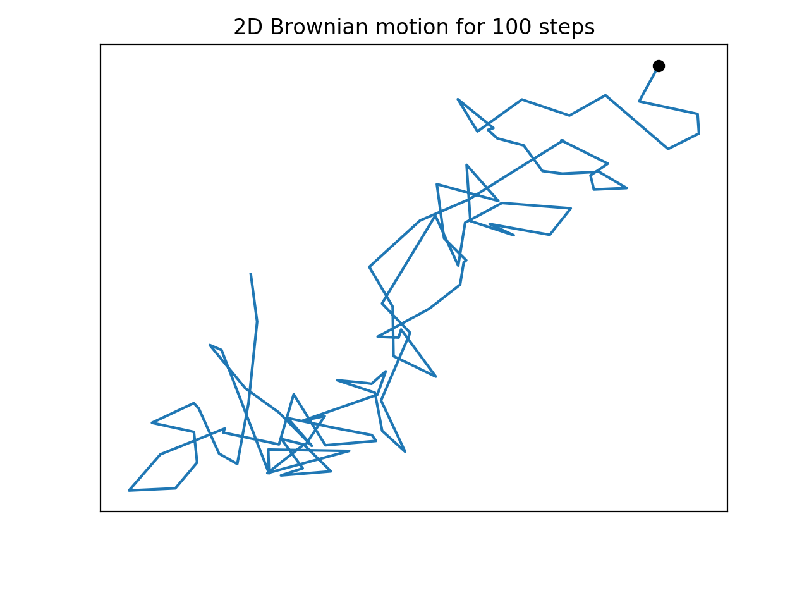

# Brownian-Motion

Minor project on 2D Brownian motion to get used to basics of GitHub. For issues, contact me [here](mailto:divusree@gmail.com).

## Usage

Copy this folder into your parent app and import Brownian.py. The file contains 2 functions: `BrownianPath` and `BrownianSim` that generates and displays a 2D Brownian walk for *nsteps* which is the number of increments. 

```from Brownian import *

bPaths = BrownianPath(100)
BrownianSim(bPaths)
```

where *nsteps = 100* and can be replaced with any positive non zero integer. 

Output for the above code:



The code was run on python3.7, numpy 1.17 and matplotlib 3.1.
For reference: https://en.wikipedia.org/wiki/Wiener_process
